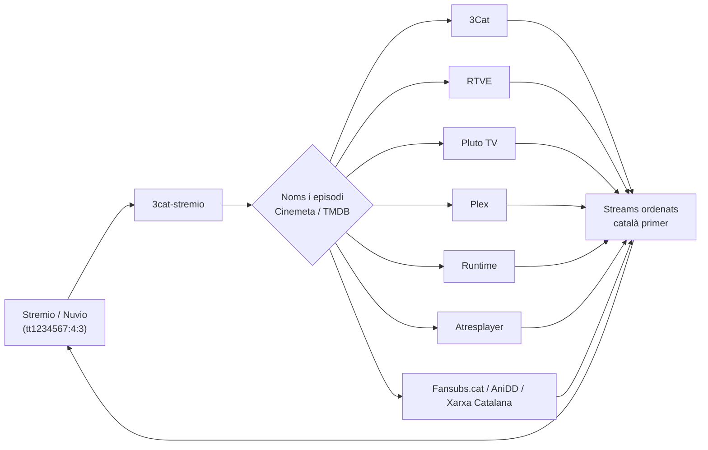

<div align="center">


&nbsp;&nbsp;&nbsp;

&nbsp;&nbsp;&nbsp;


# 3Cat Stremio

**Mira 3Cat i la resta de contingut gratuït en català i castellà des de Stremio i Nuvio.**

[](https://www.stremio.com/)
[](https://github.com/NuvioMedia/NuvioTV)
[](https://www.python.org/)
[](https://fastapi.tiangolo.com/)
[](https://www.docker.com/)

</div>

---

## Què és i per a què serveix

Stremio i Nuvio saben quin títol vols veure (per exemple *La Travessa*, T4E3), però no saben **on** es pot veure en català. Aquest addon ho resol: rep la petició, busca aquell títol en diverses fonts gratuïtes i, si el troba, retorna un enllaç de reproducció directa. Tu només toques «play».

És un addon de **streams**: no té catàlegs propis. Funciona amb qualsevol fitxa que vingui d'IMDb (`tt…`), de manera que el pots combinar amb Cinemeta, AIOMetadata o el catàleg que ja facis servir.

Va començar sent un addon només per a 3Cat i ara és una petita pila de fonts, ordenades de manera que **el català surti sempre per sobre**.

## Fonts

| Font | Què aporta | Cal credencial? |
|---|---|---|
| **3Cat (CCMA)** | Sèries, documentals, pel·lícules i animació de 3Cat, en català | No |
| **RTVE** | Catàleg general de RTVE a la carta | No |
| **Pluto TV** | Pel·lícules i sèries gratuïtes (AVOD) | No |
| **Plex** | Catàleg gratuït amb anuncis | No (compte anònim) |
| **Runtime** | Catàleg gratuït AVOD | Opcional (`RUNTIME_CS_AUTH`) |
| **Atresplayer** | Contingut gratuït sense DRM | No |
| **Fansubs.cat** | Anime subtitulat en català | No |
| **Xarxa Catalana** | *One Piece* en català | No |
| **AniDD** | Anime/animació doblada en català | Opcional (`ANIDD_PASSWORD`) |

> Només es serveix contingut **sense DRM**. Si una font marca un vídeo com a protegit, es descarta sense intentar res.

## Característiques

- **Català primer.** Les fonts es llancen en paral·lel i el resultat es presenta amb el català abans que el castellà.
- **Coincidència intel·ligent.** Tradueix el títol internacional al nom local, entén temporades i capítols (també sagues llargues com anime amb numeració absoluta) i descarta els clips massa curts.
- **Resposta ràpida i sense «forats».** Si una font va lenta, l'addon respon al cap de 8,5 s amb el que ja té i deixa acabar la resta en segon pla; la propera petició surt de la memòria cau. Això evita que els clients que abandonen als ~10 s vegin una llista buida.
- **Cerca de 3Cat optimitzada.** Pàgines demanades en paral·lel, connexió reutilitzada, memòria cau de 30 minuts i peticions idèntiques compartides.
- **Qualitat màxima per a 3Cat.** Ofereix dues opcions per a cada capítol:
  - **`1080p`**: una sola variant fixa a la millor resolució disponible.
  - **`Auto`**: adaptatiu, però començant per la millor variant (en lloc de la més baixa).
- **Opcions desactivades soles.** Una font sense credencial no es posa en marxa i no molesta.

## Com funciona



Per als vídeos de 3Cat, el reproductor demana el master HLS a `/hls/<id>.m3u8` d'aquest mateix addon. L'addon el reescriu (URLs absolutes, variants ordenades per qualitat) i el reproductor baixa el vídeo **directament de la CDN de 3Cat**: cap tros de vídeo passa pel teu servidor.

## Instal·lació

### Amb Docker (recomanat)

```bash
git clone https://github.com/sillyck/3cat-stremio.git
cd 3cat-stremio
cp .env.example .env     # omple'l (vegeu la taula de sota)
docker compose up -d --build
```

L'addon queda escoltant al port `7860`. El manifest és a:

```
http://localhost:7860/manifest.json
```

### Sense Docker

```bash
python -m venv .venv && source .venv/bin/activate   # a Windows: .venv\Scripts\activate
pip install -r requirements.txt
export PUBLIC_BASE_URL=https://el-teu-domini.exemple TMDB_API_KEY=...
uvicorn main:app --host 0.0.0.0 --port 7860
```

### Afegir-lo a Stremio

1. Obre Stremio → **Addons** → **Install from URL**.
2. Enganxa `https://el-teu-domini.exemple/manifest.json` i accepta.

### Afegir-lo a Nuvio

1. Obre Nuvio → **Addons** (ajustos) → afegeix un addon.
2. Enganxa el mateix `https://el-teu-domini.exemple/manifest.json`.

Nuvio fa servir els mateixos manifests que Stremio, així que no cal res més. Si fas servir **AIOStreams**, afegeix-lo allà com a addon personalitzat amb aquesta URL.

> **Cal HTTPS i una URL pública** perquè els dispositius fora de casa puguin obrir el manifest i els streams. Un reverse proxy com Caddy, un túnel de Cloudflare o Tailscale Funnel ho resolen fàcilment. `PUBLIC_BASE_URL` ha de ser exactament aquesta URL.

## Configuració

Es fa amb variables d'entorn (o amb el fitxer `.env`):

| Variable | Obligatòria | Per a què serveix |
|---|---|---|
| `PUBLIC_BASE_URL` | Recomanada | URL pública de l'addon, sense barra final. Activa les opcions `1080p` i `Auto` de 3Cat. Sense ella s'usa el stream tal com el dóna l'API. |
| `TMDB_API_KEY` | Recomanada | Clau gratuïta de [TMDB](https://www.themoviedb.org/settings/api) per al mapatge de temporades quan Cinemeta no té dades. |
| `ANIDD_PASSWORD` | No | Contrasenya d'AniDD. Si falta, aquesta font es desactiva. |
| `RUNTIME_CS_AUTH` | No | Capçalera d'autenticació de Runtime. Si falta, aquesta font es desactiva. |

Cap secret és al codi. L'arrencada avisa als logs de quines opcions estan sense definir.

## Endpoints

| Ruta | Descripció |
|---|---|
| `GET /manifest.json` | Manifest de Stremio (tipus `movie` i `series`, prefix `tt`) |
| `GET /stream/{tipus}/{id}.json` | Streams d'un títol, p. ex. `/stream/series/tt31452553:4:3.json` |
| `GET /hls/{id}.m3u8` | Master HLS de 3Cat, millor qualitat primer |
| `GET /hls/{id}.m3u8?q=max` | Master HLS amb només la millor variant |

## Proves

```bash
python tests/test_hls.py
```

Comprova el reescriptor de masters HLS (URLs absolutes, ordre per resolució i mode «només la millor»). No necessita dependències.

## Rendiment

Mesures reals de producció (3Cat, un cas de 571 resultats a dues pàgines):

| | Abans | Ara |
|---|---|---|
| Cerca a 3Cat | ~8,5 s | ~4 s |
| Mateixa cerca amb memòria cau | ~8,5 s | instantània |
| Resposta completa de l'addon (primera vegada) | superava el límit i sortia buida | ~6 s |

## Avís legal

Projecte **no oficial**, sense cap vincle amb la CCMA/3Cat, RTVE, Stremio, Nuvio ni cap de les plataformes esmentades. Els noms i logotips pertanyen als seus propietaris i només s'hi fa referència per identificar la compatibilitat.

L'addon no allotja ni redistribueix vídeo: només localitza contingut que aquestes plataformes ja ofereixen públicament i en retorna l'enllaç. No intenta saltar-se cap DRM. És per a ús personal; respecta les condicions d'ús de cada servei i la legislació del teu país.

## Crèdits

- [Stremio](https://www.stremio.com/) i [Nuvio](https://github.com/NuvioMedia/NuvioTV) pel protocol d'addons.
- [FastAPI](https://fastapi.tiangolo.com/), [httpx](https://www.python-httpx.org/) i [Beautiful Soup](https://www.crummy.com/software/BeautifulSoup/).
- Logotip de 3Cat via [Wikimedia Commons](https://commons.wikimedia.org/wiki/File:Logotip_de_3Cat.svg).
